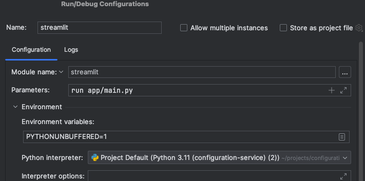

### Dev env setup

Python version: 3.11

verify python version: `python --version`  
create virtual env: `python -m venv venv`  
activate virtual env: `source venv/bin/activate`  
install dependencies: `pip install -r requirements.txt`

#### Running the streamlit app:

`streamlit run main/app.py`

Note that you (usually) don't need to rerun the app for changes to take effect,
as the script is executed on every interaction.

#### Running using PyCharm (for debugging):

  
Make sure the Python Interpreter is set to the virtual env created above: `/venv/bin/python`

### Useful streamlit links:

- [Streamlit-antd-components](https://nicedouble-streamlitantdcomponentsdemo-app-middmy.streamlit.app/) - components library
- [OAuth2 Authentication example (google)](https://discuss.streamlit.io/t/google-authentication-in-a-streamlit-app/43252/2)
- [Dataframes and Data editor](https://docs.streamlit.io/library/advanced-features/dataframes)
- [Session State](https://docs.streamlit.io/library/api-reference/session-state)
- [Robust dataframe filtering](https://blog.streamlit.io/auto-generate-a-dataframe-filtering-ui-in-streamlit-with-filter_dataframe/)
- [Deleting rows without data editor example](https://discuss.streamlit.io/t/deleting-rows-in-st-data-editor-progmatically/46337/2)
- [Experimental connection](https://blog.streamlit.io/introducing-st-experimental_connection/), [SQLConnection](https://docs.streamlit.io/library/api-reference/connections/st.connections.sqlconnection)
- [Auth2 Component](https://github.com/sfc-gh-bhess/st_oauth)